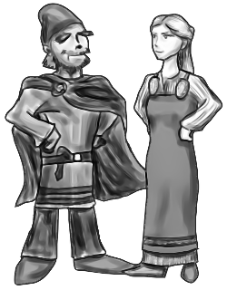

# klä

<a href="http://callego.deviantart.com/art/Viking-Clothes-334955145"></a>

*An LFE Wrapper Library used to Dress Up Erlang Libraries in a Lispy Costume*

## Introduction

Add content to me here!


## Installation

Just add it to your ``rebar.config`` deps:

```erlang
  {deps, [
    ...
    {kla, ".*",
      {git, "git@github.com:lfex/kla.git", "master"}}
      ]}.
```

And then do the usual:

```bash
    $ rebar get-deps
    $ rebar compile
```


## Usage

Add content to me here!
